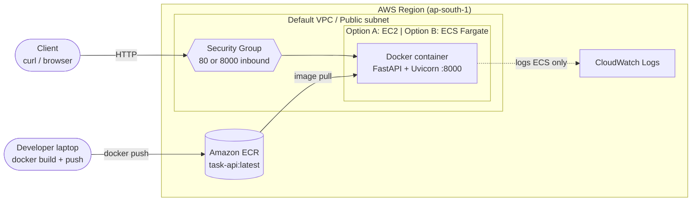

# Containerized Task API on AWS

A small FastAPI microservice, packaged with Docker, stored in **Amazon ECR**, and deployed on either **EC2** or **ECS Fargate**.

The app is deliberately simple. The point of the project is the pipeline: **code → image → registry → running container on AWS.**

## Architecture



**Request path:** Client → Security Group → EC2 instance / Fargate task → container (port 8000).
**Deploy path:** Developer → `docker push` → ECR → pulled by EC2 (`docker pull`) or ECS (task definition).

## API

| Method | Path | Description |
|---|---|---|
| GET | `/health` | Liveness check (used by Docker HEALTHCHECK) |
| GET | `/info` | Container hostname, version, time |
| POST | `/tasks` | Create task `{"title": "...", "done": false}` |
| GET | `/tasks` | List tasks |
| GET | `/tasks/{id}` | Get one task |
| PUT | `/tasks/{id}` | Update task |
| DELETE | `/tasks/{id}` | Delete task |

Interactive docs: `/docs` (Swagger UI).

> Storage is in-memory. Data resets when the container restarts, and a second replica won't share data. Fine for a demo; see "Next steps" for the fix.

## Prerequisites

- AWS account + [AWS CLI v2](https://docs.aws.amazon.com/cli/latest/userguide/getting-started-install.html) configured (`aws configure`)
- Docker
- An IAM user/role allowed to use ECR, ECS, EC2, IAM, and CloudWatch Logs

## 1. Run locally

```bash
pip install -r requirements-dev.txt
pytest
uvicorn app.main:app --reload          # http://localhost:8000/docs
```

Or in Docker:

```bash
docker build -t task-api .
docker run --rm -p 8000:8000 task-api
curl localhost:8000/health
```

## 2. Push the image to ECR

```bash
export AWS_REGION=ap-south-1
./scripts/push_to_ecr.sh
```

This creates the `task-api` repo (with scan-on-push), logs Docker into ECR, builds for `linux/amd64`, and pushes. Copy the printed image URI:

```bash
export IMAGE_URI=<account-id>.dkr.ecr.ap-south-1.amazonaws.com/task-api:latest
```

## 3A. Deploy on EC2

1. **IAM role:** create a role for EC2 with `AmazonEC2ContainerRegistryReadOnly`.
2. **Launch instance:** Amazon Linux 2023, `t3.micro` (free-tier eligible in many accounts), attach the role above.
3. **Security group:** allow inbound TCP **80** from anywhere, and **22** from *your IP only*.
4. **SSH in** and run:
   ```bash
   # copy scripts/run_on_ec2.sh to the instance (scp), then:
   IMAGE_URI=<your image uri> ./run_on_ec2.sh
   ```
5. **Test:** `curl http://<EC2_PUBLIC_IP>/health`

The script installs Docker, authenticates to ECR using the instance role, and runs the container with `--restart unless-stopped`, mapping host port 80 to container port 8000.

## 3B. Deploy on ECS Fargate

```bash
IMAGE_URI=<your image uri> AWS_REGION=ap-south-1 ./scripts/deploy_ecs_fargate.sh
```

This creates the execution role, cluster, log group, security group (port 8000), task definition, and a service with 1 task in the default VPC. Run the three commands it prints to get the task's public IP, then:

```bash
curl http://<TASK_PUBLIC_IP>:8000/health
```

Logs: CloudWatch → Log groups → `/ecs/task-api`.

## 4. Smoke test

```bash
BASE=http://<PUBLIC_IP>[:8000]
curl $BASE/info
curl -X POST $BASE/tasks -H 'Content-Type: application/json' -d '{"title":"ship it"}'
curl $BASE/tasks
```

Screenshot this working against the real AWS IP and put it in the repo. It is your proof the deployment is real.

## 5. Redeploy after a code change

```bash
./scripts/push_to_ecr.sh                       # new image to ECR
# EC2: rerun run_on_ec2.sh on the instance
# ECS: rerun deploy_ecs_fargate.sh (forces a new deployment)
```

## 6. Clean up (avoid bills)

```bash
./scripts/cleanup.sh        # ECS service, cluster, ECR repo, log group
```

Then **terminate the EC2 instance** in the console. Check for stray Elastic IPs.

## Design notes

- **Slim base image + layer caching:** dependencies are installed before app code is copied, so code-only rebuilds are fast.
- **Non-root user** inside the container.
- **HEALTHCHECK** baked into the image, and `/health` is ready to plug into an ALB target group.
- **`--platform linux/amd64`** avoids the classic "exec format error" when building on an Apple Silicon Mac.
- **IAM roles instead of access keys** on EC2/ECS, so no credentials live on the box.
- **Security group:** SSH restricted to your IP. Don't leave port 22 open to the world.

## Next steps (to level this up)

- Replace in-memory storage with **RDS** or **DynamoDB** so multiple replicas share state.
- Put an **Application Load Balancer** in front of ECS and run 2+ tasks across AZs.
- Add a **GitHub Actions** workflow: test → build → push to ECR → `aws ecs update-service` on every push to `main`, using OIDC instead of long-lived keys.
- Provision everything with **Terraform** instead of shell scripts.
- Add HTTPS with ACM + ALB and a custom domain via Route 53.
